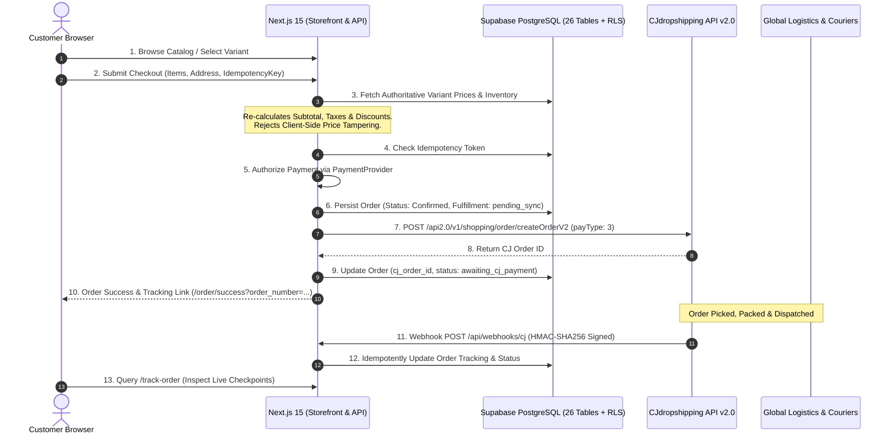

# System Architecture & Technical Specifications

**Platform**: MYCHOICE.in  
**Domain**: https://mychoice.in  
**Architectural Paradigm**: Layered Jamstack / Edge-ready Next.js 15 App Router with Supabase PostgreSQL and CJdropshipping API v2 Fulfillment.

---

## 1. High-Level System Flow

---

## 2. Core Architectural Principles

### Tier 1: Client Layer (Browser & Mobile)
- Responsive Next.js 15 client components with React 19 hooks and Tailwind CSS.
- **Zero Secrets Rule**: The browser never sees or stores `CJ_ACCESS_TOKEN`, `SUPABASE_SERVICE_ROLE_KEY`, or payment gateway private keys.
- **Client Local Storage**: Holds guest carts and regional currency preferences (`USD`, `INR`, `EUR`, `GBP`, `AED`).

### Tier 2: Application & Backend API Layer (Next.js App Router)
- **Authoritative Computing**: The server never trusts client-supplied price values or calculation subtotals.
- **Idempotency Guard**: Every order submission requires a client-generated UUID idempotency token. Accidental double-clicks or browser retries replay the saved order confirmation without duplicate database entries or double charges.
- **Resilient CJ Service Adapter**: Encapsulated in `lib/cj/` with automatic token acquisition, expiry checks, and exponential backoff retry algorithms for handling HTTP 429 and 50x upstream hiccups.
- **Development Mock Mode**: Clean mock fallbacks ensure full development and automated testing capability before external credentials are plugged in.

### Tier 3: Database & Auth Layer (Supabase PostgreSQL)
- 26 relational tables utilizing UUID primary keys, check constraints, foreign keys with referential integrity, and performance B-Tree indexes.
- Complete Row Level Security (RLS) policies enforcing that customers can only view their own orders and addresses, while admins retain role-based access.

### Tier 4: Supplier & Logistics (CJdropshipping Open API v2)
- Direct order submission through official v2 endpoints (`/v1/shopping/order/createOrderV2`).
- Real carrier tracking lookup via `/v1/logistic/orderTrack`.
- Secure webhook listener (`/api/webhooks/cj`) with HMAC-SHA256 signature verification.
