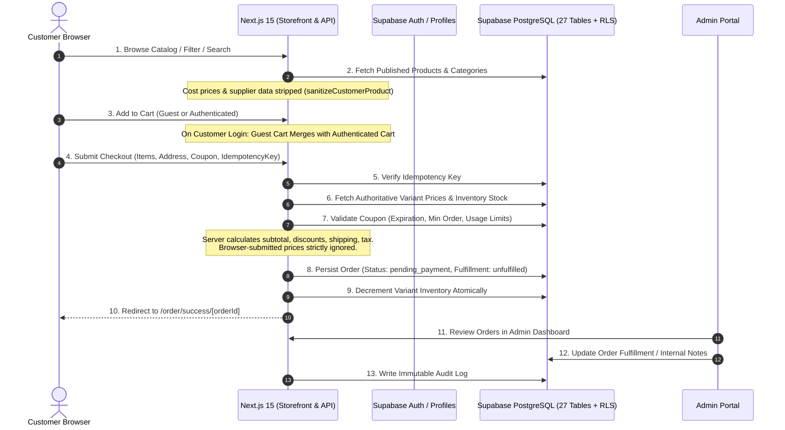

# System Architecture & Technical Specifications

**Platform**: MYCHOICE.in  
**Domain**: https://mychoice.in  
**Architectural Paradigm**: Layered Jamstack / Edge-ready Next.js 15 App Router with Supabase PostgreSQL and Future CJdropshipping API v2 Fulfillment.

---

## 1. High-Level System Flow

---

## 2. Core Architectural Tiers

### Tier 1: Client Layer (Browser & Mobile)
- Responsive Next.js 15 App Router components with React 19 hooks and Tailwind CSS.
- **Zero Secrets Rule**: The browser never sees or stores `CJ_ACCESS_TOKEN`, `SUPABASE_SERVICE_ROLE_KEY`, or payment gateway private keys.
- **Client Persistence**: Holds guest carts and regional currency preferences (`USD`, `INR`, `EUR`, `GBP`, `AED`).
- **Cart Merge**: On authentication, the guest cart is transferred to the customer's database-backed cart, with quantity validation against live stock.

### Tier 2: Application & Backend API Layer (Next.js App Router)
- **Authoritative Computing**: The server never trusts client-supplied price values or calculation subtotals.
- **Idempotency Guard**: Every order submission requires a client-generated UUID idempotency token. Accidental double-clicks or browser retries replay the saved order confirmation without duplicate database entries.
- **Modular Service Layer**:
  - `lib/auth/`: Registration, sign-in, session verification, profile management, and admin role validation.
  - `lib/products/`: Product queries, search, filtering, and sanitization function `sanitizeCustomerProduct` that removes internal supplier costs before public exposure.
  - `lib/categories/`: Category listings and admin category CRUD with orphan prevention.
  - `lib/cart/`: Cart service with inventory clamping and guest-to-account cart merging.
  - `lib/coupons/`: Server-authoritative coupon verification, percentage/fixed calculation, min-spend validation, and usage limits.
  - `lib/orders/`: Authoritative order creation, status transitions, and ownership verification.
  - `lib/admin/`: Operational metrics calculation, inventory matrix, and audit logging.
  - `lib/reviews/`: Real customer review submission with admin moderation workflows.

### Tier 3: Database & Auth Layer (Supabase PostgreSQL)
- 27 relational tables utilizing UUID primary keys, check constraints, foreign keys with referential integrity, and performance B-Tree indexes.
- Complete Row Level Security (RLS) policies enforcing that customers can only view their own orders and addresses, while admins retain role-based access verified by `is_admin()`.

### Tier 4: Future Supplier & Payment Provider Boundaries
- **CJ Dropshipping Readiness (Phase 2)**: Database tables (`products`, `product_variants`) support future external mapping fields:
  - `external_provider`
  - `external_product_id`
  - `external_variant_id`
  - `external_sku`
- **Payment Gateway Readiness (Phase 2)**: Order and payment states distinguish between `payment_status` (`pending_payment`, `paid`, `refunded`, `failed`) and `fulfillment_status` (`unfulfilled`, `processing`, `shipped`, `delivered`, `cancelled`).
