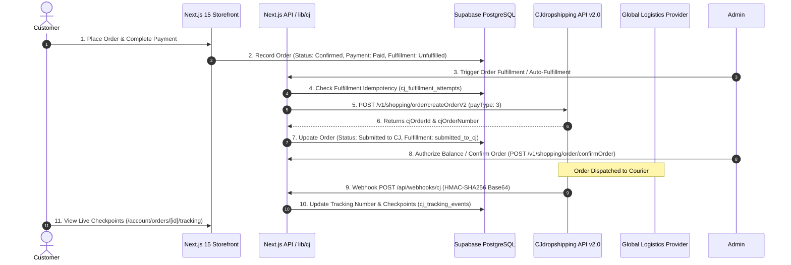

# CJ Dropshipping Open API 2.0 Integration Manual

**Platform**: MYCHOICE.in  
**Supplier Integration**: CJdropshipping Open API v2.0  
**Official Reference**: [https://developers.cjdropshipping.com/en/api/api2/](https://developers.cjdropshipping.com/en/api/api2/)  
**Fulfillment Pattern**: Asynchronous server-authoritative dropshipping pipeline with HMAC-SHA256 verified webhooks.

---

## 1. Architectural Overview



---

## 2. Security Rule Zero (Zero Browser Exposure)

- **Backend-Only Isolation**: All communication with CJ Dropshipping takes place through secure server-side modules (`lib/cj/`).
- **No Token Ingestion in Client JS**: Neither `CJ_ACCESS_TOKEN`, `CJ_API_KEY`, nor `CJ_CLIENT_SECRET` are ever passed to client components or stored in localStorage.
- **Server-Authoritative Pricing**: Supplier wholesale costs are never sent to the browser. Selling retail prices, markup calculations, and coupon discounts are evaluated entirely on the server.
- **Fulfillment Idempotency**: Double-submissions or retries check `orders.cj_order_id` and `cj_fulfillment_attempts` to guarantee that duplicate CJ orders are never generated.

---

## 3. Environment Variables

Configure these variables in your private `.env.local` (or production host secrets manager):

```env
# CJ Dropshipping Open API 2.0
CJ_API_BASE_URL=https://developers.cjdropshipping.com/api2.0
CJ_API_KEY=your_cj_api_key_here
CJ_CLIENT_ID=your_cj_account_email_here
CJ_CLIENT_SECRET=your_cj_account_password_here
CJ_OPEN_ID=your_cj_open_id_for_webhook_signatures
CJ_ACCESS_TOKEN=optional_static_access_token_override
CJ_WEBHOOK_SECRET=optional_fallback_signing_secret
```

*(Note: When credentials are not configured, the system automatically runs in zero-config Development Mock Mode).*

---

## 4. Authentication & Token Management

- **API Endpoints**:
  - Request Token: `POST /v1/authentication/getAccessToken`
  - Refresh Token: `POST /v1/authentication/refreshAccessToken`
- **Token Lifetime**: 180 days.
- **Refresh Concurrency Lock**: `CJAuthManager` implements an asynchronous mutex to ensure concurrent requests discovering an expired token do not trigger simultaneous refresh storms.
- **Header**: Requests include `CJ-Access-Token: <token>`.

---

## 5. Product Sourcing & Draft Import Workflow

1. **Catalog Search (`GET /v1/product/listV2`)**:
   - Uses the official Elasticsearch-backed API v2.0 endpoint with keyword search, price filters, and pagination.
2. **Product Details (`GET /v1/product/query?pid=...`)**:
   - Retrieves full variant options, wholesale cost, images, and package weights.
3. **Draft Import (`importCJProductAsDraft`)**:
   - Imports products strictly with status `draft` (never automatically published).
   - Generates local SKU and variant mappings.
   - Calculates selling price based on configured markup percentage.
   - Registers product-specific webhook subscription.

---

## 6. Inventory Synchronization

- **Endpoint**: `POST /v1/product/stock/queryByVid`
- **Warehouse Awareness**: Respects warehouse locations and avoids summing incompatible inventories.
- **Batching**: Queries variants in batches of 30 to comply with CJ rate limits.
- **Logging**: Writes audit records to `cj_sync_logs`.

---

## 7. Shipping Freight & Delivery Windows

- **Endpoint**: `POST /v1/logistic/freightCalculate`
- **Abstraction**: `getAvailableShippingMethods(params)` returns validated shipping options, carrier estimates, and costs.
- **Server Validation**: The server re-validates freight costs at checkout before final order persistence.

---

## 8. Order Creation & Fulfillment Safety

- **Endpoint**: `POST /v1/shopping/order/createOrderV2`
- **PayType 3 Policy**: All automated orders use `payType: 3` (Order only, pay balance later/manually) to prevent automatic, uncontrolled balance deductions.
- **Confirmation Endpoint**: `POST /v1/shopping/order/confirmOrder`
- **Eligibility Checks**:
  1. Payment verified as paid.
  2. Order not already fulfilled.
  3. Every line item mapped to a valid CJ variant ID (`external_variant_id`).
  4. Non-zero quantities and valid destination address.
  5. Fulfillment idempotency token verified.

---

## 9. Tracking & Checkpoint Normalization

- **Endpoint**: `GET /v1/logistic/orderTrack?trackNumber=...`
- **Normalized Statuses**:
  - `pending`
  - `shipped`
  - `in_transit`
  - `delivered`
  - `cancelled`
- **Customer View**: Accessible at `/account/orders/[id]/tracking` with milestone checkpoints (supplier IDs and costs omitted).

---

## 10. Webhook Architecture & Signature Verification

- **Endpoint**: `POST /api/webhooks/cj`
- **Signature Scheme**:
  - Algorithm: **HMAC-SHA256**
  - Secret: `openId` from CJ authentication
  - Message: **RAW request body** (captured as string before JSON parsing)
  - Output: **Base64** encoded
  - Header: `sign`
  - Comparison: Timing-safe byte comparison (`crypto.timingSafeEqual`)
- **Deduplication**: `messageId` unique constraint prevents duplicate processing.
- **Response SLA**: Returns HTTP 200 within approximately 3 seconds, delegating processing to asynchronous workers.
- **Product-Specific Subscriptions**: Required under CJ API 2.0 post-July 2026 regulations (`cj_webhook_subscriptions`).

---

## 11. Production Checklist

1. [ ] Log in to [CJdropshipping](https://cjdropshipping.com) → **My CJ > Authorization > API**.
2. [ ] Retrieve your `API Key` and `openId`.
3. [ ] Configure `CJ_API_KEY` and `CJ_OPEN_ID` in your production environment variables.
4. [ ] In CJ Webhook Settings, configure the webhook callback URL: `https://your-domain.com/api/webhooks/cj`.
5. [ ] Select webhook topics: `PRODUCT`, `STOCK`, `ORDER`, `LOGISTICS`.
6. [ ] Navigate to `/admin/cj` and click **Test CJ Connection** to confirm connectivity.
7. [ ] Verify that order fulfillment displays in `/admin/cj/orders`.
